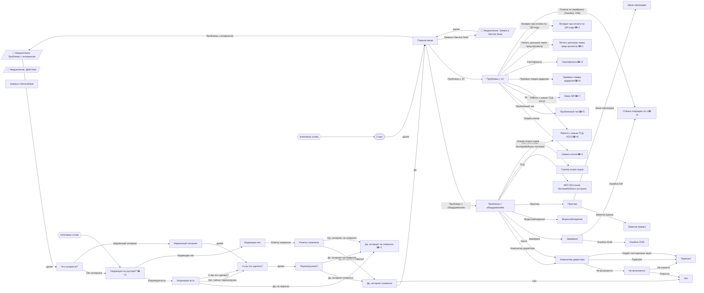
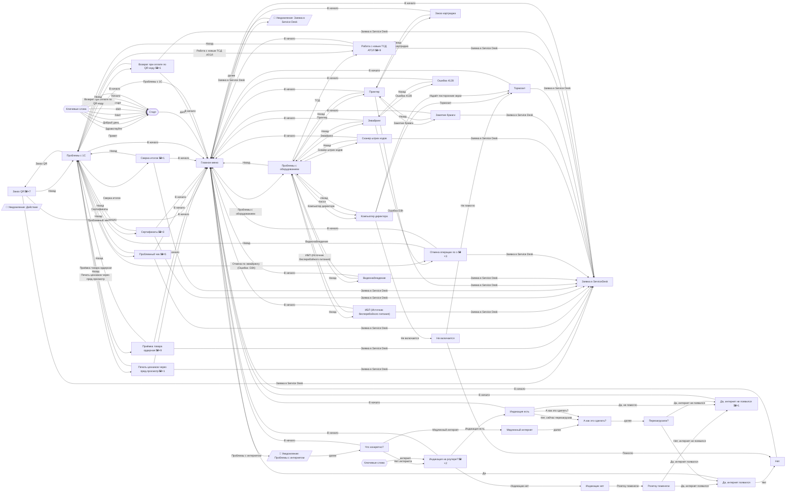

# Схема сценария

Формы: стадион — старт, шестиугольник — ключевые слова (запускают шаг из любого места), параллелограмм — уведомление,
🖼×N — число картинок в шаге (пока не перенесены в n8n).

## Упрощённая
Кнопки «Назад», «В начало» и «Заявка в Service Desk» скрыты: они есть почти в каждом шаге и ведут в главное меню,
в начало и в шаги заявки.

## Полная

